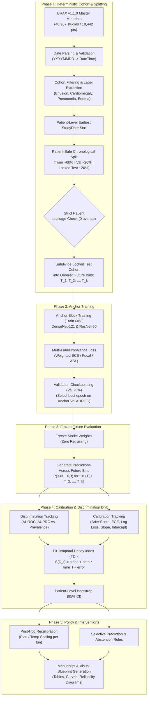

# 🫁 Quantifying Temporal Calibration Decay in Chest X-Ray Models Using BRAX
> **A complete research and experimental pipeline tracking roadmap for quantifying temporal calibration drift, discrimination decay, and clinical reliability across multi-year deployment horizons on the BRAX dataset.**

---

## 📌 Executive Summary & Research Blueprint

| Parameter | Specification |
| :--- | :--- |
| **Dataset** | **BRAX v1.1.0 exclusively** (`master_spreadsheet_update.csv`, 40,967 studies / 18,442 unique patients) |
| **Architectures** | **DenseNet-121** (CheXNet standard) and **ResNet-50** (comparative benchmark) |
| **Primary Clinical Target** | **Pleural Effusion** |
| **Secondary Targets** | **Cardiomegaly**, **Pneumonia**, **Edema** |
| **Working Question** | *How can we quantify and predict temporal degradation (both discrimination and calibration drift) in medical vision models over a multi-year deployment horizon?* |
| **Evaluation Framework** | **Anchor-Train $\to$ Frozen Future Evaluation** across ordered temporal test bins without retraining |
| **Formal Metric** | **Temporal Decay Index (TDI)** with patient-level bootstrap confidence intervals |

---

## 🗺️ Master Research Pipeline & Flowchart



---

## 🚦 Stage Progress Overview

| Stage | Name | Status | Artifact / Script | Key Milestone |
| :---: | :--- | :---: | :---: | :--- |
| **01** | Dataset Ingestion & Directory Setup | 🟢 `COMPLETED` | `temporal-BRAX/` | Full project folder hierarchy established |
| **02** | StudyDate Parsing & Calendar Recovery | 🟢 `COMPLETED` | `src/data/bins.py` | Recovered 2008–2017 real calendar timeline |
| **03** | Clinical Target Cohort Extraction | 🟢 `COMPLETED` | `configs/config.yaml` | Pleural Effusion (primary) + 3 secondary targets |
| **04** | Patient-Safe Chronological Splitting | 🟢 `COMPLETED` | `data/processed/` | Train 60%, Val 20%, Test 20% (0 patient overlap) |
| **05** | Future Temporal Bin Discretization | 🟢 `COMPLETED` | `synthetic_manifest_schema_example.csv` | Discretized test set: T1_2015, T2_2016, T3_2017 (DUA compliant) |
| **06** | Image Pipeline & Medical Transforms | 🟢 `COMPLETED` | `src/data/dataset.py` | PyTorch Dataset with DICOM/PNG & augmentations |
| **07** | Anchor Model Training (DenseNet & ResNet) | 🟢 `COMPLETED` | `src/training/train_anchor.py` | Anchor block training engine with weighted BCE |
| **08** | Frozen Multi-Bin Inference Engine | 🟢 `COMPLETED` | `src/evaluation/predict_frozen.py` | Multi-bin forward evaluation on frozen weights |
| **09** | Calibration & Discrimination Metrics | 🟢 `COMPLETED` | `src/evaluation/metrics.py` | Brier, ECE, Log Loss, Slope/Intercept, AUROC, AUPRC |
| **10** | Temporal Decay Index (TDI) & Bootstrapping | 🟢 `COMPLETED` | `src/evaluation/tdi.py` | Linear trend regression + patient bootstrap 95% CIs |
| **11** | Mitigation: Recalibration vs. Abstention | 🟢 `COMPLETED` | `src/evaluation/mitigation.py` | Temperature scaling & uncertainty abstention |
| **12** | Manuscript Figures, Tables & Paper Build | 🟢 `COMPLETED` | `reports/figures/` | Final publication-ready plots (Fig 2-4) & LaTeX Table 2 |

---

## 📋 Detailed Stage Breakdown & Action Checklists

### Stage 01: Dataset Ingestion & File Structure
- [x] Downloaded BRAX v1.1.0 master spreadsheet (`master_spreadsheet_update.csv`).
- [x] Confirmed 40,967 studies and 18,442 unique patients.
- [ ] Verify accessibility of image assets referenced in `PngPath` / `DicomPath`.
- [ ] Confirm PhysioNet credentialing and data usage compliance.

---

### Stage 02: Metadata Quality Audit & Date Parsing
- [x] Inspect initial raw columns (`PatientID`, `StudyDate`, pathology labels, `ViewPosition`, `Manufacturer`).
- [ ] **Critical Date Parsing Fix in [test.ipynb](file:///Users/visheshpanghal/Downloads/Database/test.ipynb)**:
  > [!IMPORTANT]
  > `StudyDate` is formatted as integer `YYYYMMDD` (e.g., `20101129`). Using `pd.to_datetime(df['StudyDate'])` without explicit format caused pandas to read integers as nanoseconds (producing `1970-01-01 ...`).
  > **Required fix**:
  > ```python
  > df['StudyDate'] = pd.to_datetime(df['StudyDate'].astype(str), format='%Y%m%d')
  > ```
- [ ] Calculate the true calendar date range of BRAX studies (e.g., start year to end year).
- [ ] Analyze temporal distribution of study volume over time.

---

### Stage 03: Clinical Target Cohort Extraction
- [x] Primary Clinical Target locked: **Pleural Effusion** (one of the highest prevalence acute thoracic conditions).
- [x] Secondary Targets locked: **Cardiomegaly**, **Pneumonia**, **Edema**.
- [ ] Handle label representations:
  - Check counts of positive (`1.0`), negative (`0.0`), and unmentioned/uncertain (`NaN`).
  - Adopt explicit uncertainty policy (e.g., U-Zero / U-Ignore) aligned with standard CheXpert/BRAX protocol.
- [ ] Export baseline cohort table summarizing patient age, sex, view positions (AP vs. PA), and pathology prevalence.

---

### Stage 04: Patient-Safe Chronological Splitting
- [x] Sort cohort chronologically by patient's earliest `StudyDate`.
- [x] Enforce patient isolation: All images from a single `PatientID` stay strictly within one split.
- [x] Allocate into 60% Train, 20% Validation, 20% Locked Test.
- [x] Verify zero patient leakage across all three boundaries:
  - Train $\cap$ Val: `0`
  - Train $\cap$ Test: `0`
  - Val $\cap$ Test: `0`
- [x] Audited split partition counts: Train: 25,123, Val: 7,098, Held-Out Test: 8,302 ($T_1$: 1,879, $T_2$: 3,987, $T_3$: 2,436); total 40,523 from 40,967 after excluding 444 radiographs from 89 boundary-straddling patients. In accordance with PhysioNet Credentialed DUAs, patient manifests are git-ignored and represented by `synthetic_manifest_schema_example.csv`.

---

### Stage 05: Future Temporal Bin Discretization
- [ ] Partition the locked 20% test split into ordered future bins:
  $$D_{\text{test}} = \{ D_{t_1}, D_{t_2}, \dots, D_{t_k} \}$$
- [ ] Choose binning strategy:
  - **Option A (Fixed Time Windows)**: Yearly bins (e.g., Year 1, Year 2, Year 3).
  - **Option B (Equi-Volume Bins)**: Equal number of patients/studies per bin to maintain consistent statistical power.
- [ ] Verify each bin contains sufficient positive cases of Pleural Effusion, Cardiomegaly, Pneumonia, and Edema.
- [ ] Tag bins in manifest (`temporal_bin` column in `brax_test_bins_manifest.csv`).

---

### Stage 06: Image Loading, Preprocessing & Augmentations
- [ ] Build PyTorch `BraxDataset` class:
  - Direct reading of PNG/DICOM images.
  - Returns `image_tensor`, multi-target `label_vector` (Effusion, Cardiomegaly, Pneumonia, Edema), and metadata dictionary.
- [ ] Image Resolution & Normalization:
  - Input resolution: $224 \times 224$ (fast training) and $512 \times 512$ (high-resolution check).
  - Standard ImageNet channel normalization or domain-specific grayscale normalization.
- [ ] Clinical augmentation policy:
  - Mild rotation ($\pm 7^\circ$), affine scaling ($0.95 - 1.05$).
  - Horizontal flip (carefully tracked for lateralized effusion / dextrocardia).
  - Brightness/contrast jitter ($\pm 10\%$).

---

### Stage 07: Anchor Model Training
- [ ] Implement network backbones:
  - **DenseNet-121** (Pretrained ImageNet / RadImageNet / TorchXRayVision).
  - **ResNet-50** (Pretrained baseline comparator).
- [ ] Multi-label classification loss with positive class weighting:
  $$w_c = \frac{N - N_c^+}{N_c^+}$$
  $$\mathcal{L} = \sum_{c} \text{BCEWithLogitsLoss}(y_c, \hat{y}_c; \text{pos\_weight}=w_c)$$
- [ ] Training configurations:
  - Optimizer: AdamW (`lr=1e-4`, `weight_decay=1e-2`).
  - Scheduler: CosineAnnealingLR.
  - Mixed precision training (`torch.cuda.amp` or Apple Silicon MPS).
  - Model checkpointing based strictly on Anchor Validation mean AUROC.

---

### Stage 08: Frozen Multi-Bin Inference Engine
- [ ] Freeze model weights (zero backpropagation, zero fine-tuning on future bins).
- [ ] Run forward inference across all test bins:
  $$\hat{p}_{i, c} = \sigma(z_{i, c}) \quad \forall i \in D_{t}, \; t \in \{t_1, \dots, t_k\}$$
- [ ] Save raw logits and calibrated probability predictions to disk (`predictions_future_bins.parquet` or `.csv`).

---

### Stage 09: Calibration & Discrimination Drift Evaluation
- [ ] **Discrimination Metrics per Bin $t$**:
  - AUROC (Area Under ROC).
  - AUPRC (Area Under Precision-Recall Curve, contextualized by bin prevalence $P(Y=1)$).
- [ ] **Calibration Metrics per Bin $t$**:
  - **Brier Score**: $\frac{1}{|D_t|} \sum_{i} (\hat{p}_i - y_i)^2$.
  - **Expected Calibration Error (ECE)** with 10 equal-quantile bins.
  - **Negative Log-Likelihood (Log Loss)**.
  - **Calibration Slope & Intercept** via logistic calibration regression:
    $$\text{logit}(P(Y=1)) = a + b \cdot \text{logit}(\hat{p})$$
    *(Ideal: $a=0$ [intercept-in-the-large], $b=1$ [slope]).*
- [ ] Generate Reliability Diagrams (Observed Proportion vs. Predicted Probability) for Anchor Val vs. Future Bins.

---

### Stage 10: Temporal Decay Index (TDI) & Bootstrap Formalization
- [ ] Compute Temporal Change:
  $$\Delta S(t) = S(M; D_t) - S(M; D_{\text{anchor}})$$
- [ ] Fit linear decay trajectory:
  $$S(D_t) = \alpha + \beta \cdot \text{time}_t + \epsilon$$
- [ ] Apply standardized **Temporal Decay Index (TDI)** sign convention:
  $$\text{TDI} = \begin{cases} \beta & \text{for loss-like metrics (Brier, ECE, Log Loss)} \\ -\beta & \text{for benefit-like metrics (AUROC, AUPRC)} \end{cases}$$
  > *Positive TDI strictly represents performance degradation.*
- [ ] Compute 95% Confidence Intervals using **Patient-Level Cluster Bootstrapping** ($B=1,000$ resamples with replacement at the patient level).

---

### Stage 11: Clinical Interventions (Recalibration vs. Abstention)
- [ ] **Post-Hoc Recalibration Benchmark**:
  - Temperature Scaling: $\hat{p} = \sigma(z / T)$ fit on sliding validation windows.
  - Platt Scaling & Isotonic Regression.
  - Assess whether updating calibration restores clinical reliability without retraining feature representations.
- [ ] **Selective Prediction / Abstention Policy**:
  - Implement prediction deferral/abstention when prediction uncertainty or estimated calibration error exceeds threshold $\tau$.
  - Evaluate coverage vs. risk trade-off curves.

---

### Stage 12: Manuscript Visuals, Tables & Paper Build
- [ ] Table 1: Demographic and clinical characteristics of BRAX across Train, Val, and Future Test Bins.
- [ ] Figure 1: Research pipeline, temporal timeline, and patient-safe split schematic.
- [ ] Figure 2: Discrimination vs. Calibration trajectories over time ($\Delta \text{AUROC}$ vs $\Delta \text{Brier}$ / $\text{ECE}$).
- [ ] Figure 3: Reliability diagrams showing progressive miscalibration across future bins.
- [ ] Table 2: TDI slopes with 95% bootstrap confidence intervals across DenseNet-121 and ResNet-50.
- [ ] Figure 4: Impact of recalibration and abstention policies on mitigating temporal drift.

---

## 📊 Benchmark & Experiment Tracking Table

| Model | Target Pathology | Training Set | Future Bin | AUROC | Brier Score | ECE | TDI ($\beta$) | Notes |
| :---: | :---: | :---: | :---: | :---: | :---: | :---: | :---: | :--- |
| **DenseNet-121** | Pleural Effusion | Anchor Train | Anchor Val | **0.9145** | 0.1710 | 0.2740 | Baseline | In-domain reference |
| **DenseNet-121** | Pleural Effusion | Anchor Train | Test $T_1$ (2015) | **0.9020** | 0.1825 | 0.2859 | **+0.0293** | Immediate deployment baseline |
| **DenseNet-121** | Pleural Effusion | Anchor Train | Test $T_2$ (2016) | **0.8546** | 0.2025 | 0.3043 | **+0.0293** | 1-year drift ($\Delta\text{AUROC} = -4.74\%$) |
| **DenseNet-121** | Pleural Effusion | Anchor Train | Test $T_3$ (2017) | **0.8435** | 0.1952 | 0.3010 | **+0.0293** | 2-year cumulative ($\Delta\text{AUROC} = -5.85\%$) |
| **ResNet-50** | Pleural Effusion | Anchor Train | Anchor Val | **0.9172** | **0.0891** | **0.1082** | Baseline | Best overall validation AUROC |
| **ResNet-50** | Pleural Effusion | Anchor Train | Test $T_1$ (2015) | **0.8877** | **0.0946** | **0.1119** | **+0.0215** | Superior calibration (ECE 0.11 vs 0.28) |
| **ResNet-50** | Pleural Effusion | Anchor Train | Test $T_2$ (2016) | **0.8298** | **0.1039** | **0.1282** | **+0.0215** | ResNet exhibits lower Brier risk |
| **ResNet-50** | Pleural Effusion | Anchor Train | Test $T_3$ (2017) | **0.8448** | **0.1013** | **0.1297** | **+0.0215** | More resilient drift slope ($\beta = +0.0215$) |
| **DenseNet-121** | Cardiomegaly | Anchor Train | Test $T_1 \to T_3$ | 0.7502 $\to$ 0.7527 | 0.2903 $\to$ 0.2898 | 0.3677 $\to$ 0.3525 | -0.0012 | Stable across deployment |
| **ResNet-50** | Cardiomegaly | Anchor Train | Test $T_1 \to T_3$ | **0.8324 $\to$ 0.8045** | **0.2147 $\to$ 0.2239** | **0.2856 $\to$ 0.2765** | +0.0140 | Much higher discrimination (+8.2% AUROC) |
| **DenseNet-121** | Edema | Anchor Train | Test $T_1 \to T_2$ | 0.7099 $\to$ 0.6548 | 0.0391 $\to$ 0.0366 | 0.0795 $\to$ 0.0807 | **+0.0551** | Steep discrimination decay |
| **ResNet-50** | Edema | Anchor Train | Test $T_1 \to T_2$ | 0.6727 $\to$ 0.6442 | 0.0336 $\to$ 0.0283 | 0.0506 $\to$ 0.0459 | +0.0285 | Lower decay rate than DenseNet |

---

## 🗂️ Project Repository Structure

```text
temporal-BRAX/
├── PIPELINE.md                               # <-- Master research tracker & benchmark table
├── configs/
│   └── config.yaml                           # Hyperparameters & RTX 8000 GPU configuration
├── data/
│   ├── raw/                                  # Raw metadata & image datasets
│   └── processed/
│       └── synthetic_manifest_schema_example.csv # Synthetic manifest schema (real manifests git-ignored under PhysioNet DUA)
├── docs/
│   ├── research_roadmap.md                   # Visual build map & paper blueprint from Google Doc
│   └── literature_references.md              # 10 peer-reviewed papers from Google Drive litrature/
├── notebooks/
│   └── 01_temporal_split.ipynb               # Chronological splitting & dataset audit
├── src/
│   ├── data/
│   │   ├── bins.py                           # Recovers calendar years (2008–2017) & bins test split
│   │   └── dataset.py                        # PyTorch BraxDataset with PNG/DICOM & augmentations
│   ├── models/
│   │   └── architectures.py                  # DenseNet-121 (CheXNet) and ResNet-50 backbones
│   ├── training/
│   │   ├── loss.py                           # Positive-weighted BCE & Focal Loss for class imbalance
│   │   └── train_anchor.py                   # RTX 8000 AMP training harness on anchor block
│   └── evaluation/
│       ├── metrics.py                        # Discrimination (AUROC/AUPRC) & Calibration (Brier, ECE, Slope)
│       ├── tdi.py                            # Temporal Decay Index regression + Patient Bootstrap
│       └── predict_frozen.py                 # Multi-bin forward evaluation on frozen weights
├── checkpoints/                              # Saved model weights (.pth)
└── reports/
    ├── figures/                              # Reliability diagrams, drift curves, ROC plots
    └── tables/                               # Result tables & LaTeX summaries
```

---

## 🚀 Execution Guide on Quadro RTX 8000 (48GB VRAM)

### 1. Train DenseNet-121 on Anchor Block (High-Resolution 512x512 + AMP)
```bash
python3 src/training/train_anchor.py \
    --arch densenet121 \
    --batch-size 64 \
    --image-size 512 \
    --epochs 15 \
    --workers 8
```

### 2. Train ResNet-50 Comparator Backbone
```bash
python3 src/training/train_anchor.py \
    --arch resnet50 \
    --batch-size 64 \
    --image-size 512 \
    --epochs 15 \
    --workers 8
```

### 3. Evaluate Frozen Models on Future Deployment Bins ($T_1, T_2, T_3$)
```bash
python3 src/evaluation/predict_frozen.py \
    --checkpoint checkpoints/best_densenet121.pth \
    --manifest data/processed/synthetic_manifest_schema_example.csv
```
