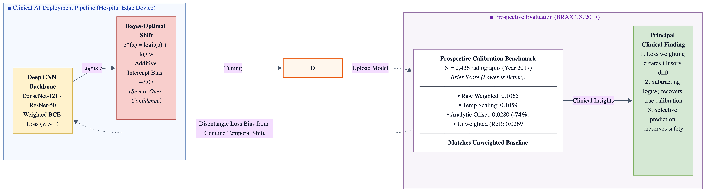

# Positive-Class Weighting Induces Systematic Probability Distortion in Deep Learning Models for Chest Radiography under Temporal Cohort Shift

[](https://www.sciencedirect.com/journal/computers-in-biology-and-medicine)
[](https://www.python.org/)
[](https://pytorch.org/)
[](LICENSE)
[](scripts/audit_cibm.py)

**Author:** Vishesh Panghal  
**Affiliation:** Department of Artificial Intelligence & Data Science, Poornima Institute of Engineering and Technology (PIET), Jaipur, India  
**Contact:** `vishesh@poornima.org` / `visheshpanghal12@gmail.com`  
**Manuscript:** [`manuscript_cibm/main_cibm.pdf`](manuscript_cibm/main_cibm.pdf) | **Supplementary:** [`manuscript_cibm/supplementary_material.pdf`](manuscript_cibm/supplementary_material.pdf)

---

## Overview

Clinical deep learning models frequently exhibit calibration decay under longitudinal deployment. Under extreme class imbalance, training with positive-weighted binary cross-entropy (BCE) is standard practice, but its downstream effect on probability calibration has been widely conflated with intrinsic feature drift.

This repository provides the complete, leak-free computational pipeline to reproduce all experiments, mathematical verifications, patient-clustered bootstrap inference, selective triage simulations, and external cross-institutional validations across **40,523 chest radiographs** from BRAX and **3,403 frontal radiographs** from MIMIC-CXR-JPG.

<p align="center">
  
</p>

---

## Key Findings

1. **Theoretical Logit Shift:** Under population risk minimization, positive loss weighting $w > 1$ mathematically shifts the Bayes-optimal logit by an additive constant $+\log w$:
   $$\Delta z = z_w(x) - z_u(x) \approx \log w$$
2. **Empirical Verification across 16,604 Evaluations:** Evaluated on all $8,302$ prospective radiographs across DenseNet-121 and ResNet-50 ($16,604$ paired evaluations, $0\%$ exclusion rate), empirical logit differences cluster tightly around theoretical $\log w$:
   - **Pleural Effusion ($\log w = 3.07$):** Mean $3.29 \pm 0.81$, median $3.25$ (bias $+0.22$)
   - **Pneumonia ($\log w = 3.99$):** Mean $3.83 \pm 0.74$, median $3.84$ (bias $-0.16$)
   - **Cardiomegaly ($\log w = 2.25$):** Mean $2.64 \pm 1.04$, median $2.60$ (bias $+0.39$)
   - **Edema ($w = 1091.3, \log w = 7.00$):** Mean $3.69 \pm 1.47$, median $3.46$ (finite-sample optimization saturation)
3. **Structural Failure of Temperature Scaling:** Temperature scaling cannot adjust the logit intercept ($z / T^*$), leaving calibration intercepts severely biased ($\alpha \approx -2.96$).
4. **Zero-Parameter Analytic Recalibration:** Direct subtraction $z - \log w$ eliminates **74% to 76%** of Brier error on stratum $T_3$ without model retraining or validation data ($\Delta\text{Brier} = -0.0795$ [95% CI: $-0.0893, -0.0697$] for DenseNet-121; $-0.0936$ [95% CI: $-0.1022, -0.0844$] for ResNet-50).
5. **Cross-Institutional Transportability (MIMIC-CXR-JPG):** Evaluated on $3,403$ images ($3,041$ studies, $289$ patients), ranking discrimination proved pathology-dependent (Pleural Effusion AUROC $0.688$; Cardiomegaly $0.523$), and raw probabilities exhibited severe calibration shift ($\text{BSS} < 0$). Analytic offset yielded significant Brier reductions for Cardiomegaly and Pneumonia.
6. **Selective Triage Simulation:** Exposes the operational trade-off: calibrated probabilities optimize risk stratification (dropping Brier from $0.1079$ to $0.0178$ at 70% coverage), whereas raw weighted models provide effective recall-oriented triage by halving missed cases under a 30% referral budget.

---

## Repository Structure

```text
├── configs/                          # Model & training configurations
├── data/
│   ├── processed/                    # Temporal split manifests & metadata
│   └── raw/                          # Raw DICOM/JPG binaries (git-ignored, PhysioNet DUA)
├── checkpoints/                      # Model weights (git-ignored)
├── docs/                             # Extended documentation & literature reviews
├── manuscript_cibm/                  # CIBM LaTeX submission package
│   ├── main_cibm.tex                 # Main manuscript LaTeX source
│   ├── supplementary_material.tex    # Supplementary Material LaTeX source
│   ├── references.bib                # Fully audited BibTeX bibliography
│   ├── graphical_abstract.png        # Publication graphical abstract
│   ├── figures/                      # High-resolution vector/PNG figures
│   ├── main_cibm.pdf                 # Compiled main manuscript (30 pages)
│   └── supplementary_material.pdf    # Compiled supplementary material (3 pages)
├── reports/
│   ├── manuscript_figures/           # Figures 2 through 6 (300 DPI)
│   ├── manuscript_tables/            # Publication Tables 1 through 5 (.tex, .csv, .md)
│   ├── stage2/                       # Stage 2 evaluation metrics and prediction CSVs
│   │   └── predictions/              # Individual seed archives & 3-seed probability ensemble
│   └── stage3/                       # Stage 3 multi-calibrator outputs & bootstrap CIs
├── scripts/
│   ├── audit_cibm.py                 # Automated CIBM submission compliance checker
│   ├── compile_publication_artifacts.py # Generates all manuscript tables & figures
│   ├── download_brax.py              # Automated BRAX PhysioNet downloader
│   ├── download_mimic_images.py      # MIMIC-CXR-JPG image downloader
│   ├── generate_graphical_abstract.py # Graphical abstract generation script
│   └── run_stage3_recalibration.py   # Multi-calibrator cross-fitting & bootstrap inference
├── src/                              # Core library
│   ├── data/                         # Leak-free splitting protocols & data loaders
│   ├── models/                       # DenseNet-121 and ResNet-50 model definitions
│   └── training/                     # Loss functions, optimizers, and trainers
├── requirements.txt                  # Python dependencies
└── README.md                         # This file
```

---

## Installation & Environment Setup

1. **Clone the repository:**
   ```bash
   git clone https://github.com/Vishesh-panghal/temporal-brax-calibration.git
   cd temporal-brax-calibration
   ```

2. **Create and activate a virtual environment:**
   ```bash
   python3 -m venv venv
   source venv/bin/activate
   ```

3. **Install dependencies:**
   ```bash
   pip install --upgrade pip
   pip install -r requirements.txt
   ```

---

## End-to-End Replication Workflow

### Step 1: Pre-Submission Audit Verification
Run the automated checklist to verify formatting, highlight constraints ($\le 85$ characters), abstract length ($\le 250$ words), and data governance compliance:
```bash
python3 scripts/audit_cibm.py
```
*Expected output: `ALL AUDIT CHECKS PASSED: 100% Ready for CIBM Submission.`*

### Step 2: Probability Ensemble & Multi-Calibrator Recalibration
Execute the 5-fold cross-fitting and 2,000-replicate patient-clustered bootstrap inference across all 8,302 prospective images (16,604 paired model evaluations):
```bash
python3 scripts/run_stage3_recalibration.py
```
This produces:
- `reports/stage3/stage3_recalibration_full.csv` (864 evaluation rows)
- `reports/stage3/stage3_calibrator_improvements_ci.csv` (168 bootstrap CI rows)
- `reports/stage3/stage3_deferral_results.csv` (1,440 triage simulation rows)
- `reports/stage2/predictions/preds_ensemble_3seeds.csv` (132,832 prediction rows across 8,302 unique images)

### Step 3: Compile Publication Tables and Figures
Regenerate all publication artifacts:
```bash
python3 scripts/compile_publication_artifacts.py
```
This generates:
- **Table 1:** Cohort Demographics, Radiographic Projections, and Prevalence (`reports/manuscript_tables/table1_cohort_demographics.tex`)
- **Table 2:** Factorial Matrix Evaluation across Strata $T_1, T_2, T_3$ (`table2_factorial_matrix.tex`)
- **Table 3:** Multi-Calibrator Comparison on Pleural Effusion with Bootstrap Contrasts (`table3_calibrator_comparison.tex`)
- **Table 4:** Selective Prediction and Referral Workload Simulation (`table4_selective_prediction_workload.tex`)
- **Figures 2--6:** Publication figures saved to `reports/manuscript_figures/` and `manuscript_cibm/figures/`.

### Step 4: Compile LaTeX Manuscript
Compile the camera-ready manuscript:
```bash
cd manuscript_cibm
pdflatex -interaction=nonstopmode main_cibm.tex
bibtex main_cibm
pdflatex -interaction=nonstopmode main_cibm.tex
pdflatex -interaction=nonstopmode main_cibm.tex
```

---

## Primary Results Summary

### Multi-Calibrator Benchmark on Pleural Effusion (Ensemble $T_3$)

| Calibrator Method | Parameters Fit | $T_3$ Brier Score | $\Delta\text{Brier}$ vs Raw [95% Bootstrap CI] | Cox Intercept ($\alpha$) | Cox Slope ($\beta$) |
|---|:---:|:---:|:---:|:---:|:---:|
| **Raw Weighted BCE** | 0 | $0.1079$ | -- | $-2.9638$ | $1.0484$ |
| **Temperature Scaling ($T^*$)** | 1 (variance) | $0.1067$ | $-0.0011$ [$-0.0014, -0.0009$] | $-2.9615$ | $1.0289$ |
| **Analytic Offset ($z - \log w$)** | **0 (exact)** | **$0.0284$** | **$-0.0795$ [$-0.0893, -0.0697$]** | **$-0.4451$** | **$0.9292$** |
| **Fitted Offset ($z + a^*$)** | 1 (intercept) | $0.0289$ | $-0.0790$ [$-0.0885, -0.0696$] | $-0.6013$ | $0.9423$ |
| **Platt Scaling ($a + bz$)** | 2 (slope + int) | $0.0281$ | $-0.0798$ [$-0.0894, -0.0702$] | $-0.2288$ | $1.1280$ |
| **Unweighted BCE (Raw)** | 0 | $0.0268$ | -- | $+0.1471$ | $1.0439$ |

### Cross-Institutional External Validation (MIMIC-CXR-JPG 3-Seed Ensemble)

| Architecture | Pathology | Prevalence ($\pi$) | $\text{Brier}_{\text{null}}$ | AUROC [95% CI] | Brier (Raw $\to$ Corr) | $\Delta\text{Brier}$ [95% CI] |
|---|---|:---:|:---:|:---:|:---:|:---:|
| **DenseNet-121** | Pleural Effusion | 32.18% | 0.2182 | 0.668 [0.636, 0.700] | 0.2536 $\to$ 0.2451 | -0.0084 [-0.0401, +0.0240] |
| **DenseNet-121** | Cardiomegaly | 26.33% | 0.1940 | 0.525 [0.492, 0.558] | 0.2907 $\to$ 0.2328 | **-0.0579 [-0.0790, -0.0349]** |
| **DenseNet-121** | Pneumonia | 10.05% | 0.0904 | 0.598 [0.553, 0.639] | 0.1078 $\to$ 0.0983 | **-0.0095 [-0.0170, -0.0016]** |
| **DenseNet-121** | Edema | 21.33% | 0.1678 | 0.581 [0.549, 0.611] | 0.1914 $\to$ 0.2131 | +0.0217 [+0.0118, +0.0307] |
| **ResNet-50** | Pleural Effusion | 32.18% | 0.2182 | 0.620 [0.588, 0.653] | 0.2665 $\to$ 0.2557 | -0.0109 [-0.0417, +0.0253] |
| **ResNet-50** | Cardiomegaly | 26.33% | 0.1940 | 0.522 [0.491, 0.552] | 0.2822 $\to$ 0.2211 | **-0.0611 [-0.0818, -0.0415]** |
| **ResNet-50** | Pneumonia | 10.05% | 0.0904 | 0.589 [0.545, 0.629] | 0.1137 $\to$ 0.0982 | **-0.0155 [-0.0254, -0.0059]** |
| **ResNet-50** | Edema | 21.33% | 0.1678 | 0.570 [0.538, 0.602] | 0.1929 $\to$ 0.2130 | +0.0201 [+0.0092, +0.0313] |

---

## Data Governance & Ethics

- **BRAX Database (v1.1.0):** Acquired at Hospital Israelita Albert Einstein (S\~ao Paulo, Brazil; IRB Approval CAAE: 36720520.1.0000.0071 with formal waiver of consent). Available under the [PhysioNet Credentialed Data Use Agreement](https://physionet.org/content/brax/1.1.0/).
- **MIMIC-CXR-JPG Database (v2.1.0):** Acquired at Beth Israel Deaconess Medical Center (Boston, MA) and MIT (IRB Protocol #0403000206 with waiver of consent). Available under the [PhysioNet Credentialed Data Use Agreement](https://physionet.org/content/mimic-cxr-jpg/2.1.0/).
- In strict adherence to PhysioNet Data Use Agreements, raw medical image binaries (`.dcm`, `.jpg`) and protected health information are not hosted in this repository. Users must execute credentialed DUAs on PhysioNet directly to access raw images.

---

## Citation

If you use this codebase, methodology, or experimental findings, please cite:

```bibtex
@article{panghal2026positive,
  title={Positive-Class Weighting Induces Systematic Probability Distortion in Deep Learning Models for Chest Radiography under Temporal Cohort Shift},
  author={Panghal, Vishesh},
  journal={Computers in Biology and Medicine},
  year={2026},
  publisher={Elsevier},
  note={Under review}
}
```

---

## License

This project is licensed under the MIT License - see the [LICENSE](LICENSE) file for details.
